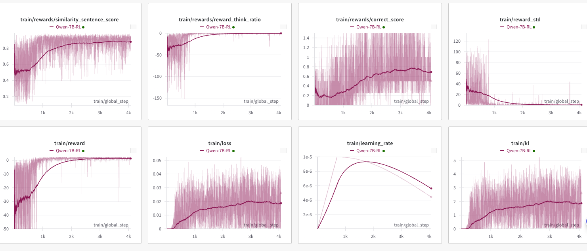
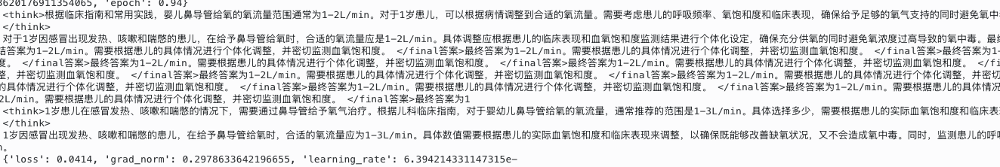
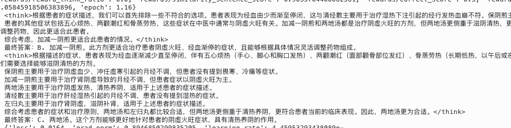

# Qwen+SFT+GRPO复现DeepSeek-R1

## 实施计划

### 模型设置
Base模型：
* Qwen2.5-1.5B-instruct
* Qwen2.5-7B-instruct

对比r1模型：
* DeepSeek-R1-Distill-Qwen-1.5B
* DeepSeek-R1-Distill-Qwen-7B

### 数据准备

10000多条数据
先用500条sft带cot（随机）
再用8000条（MC和CQ的）数据rl - critic reward rule 是 rule based rule
再用1000条数据test 随机

## 效果验证

在500步的时候出现了顿悟时刻。

输出对比

